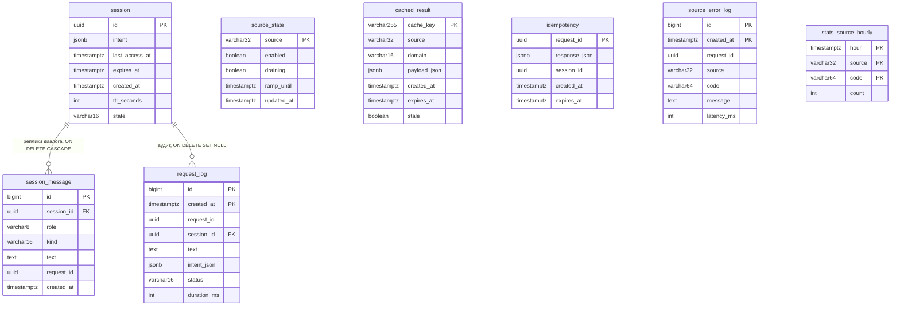

# ER-модель базы StormEvent

Схема `storm`, 8 таблиц. Офферы и комбинации **не персистятся** (ADR-032):
они вычисляются на лету, в БД лежат только сессия, её реплики, кэш, окно
дедупликации, журналы и агрегаты. `circuit_state` не делаем (ADR-VL-04).

Диаграмма в нотации Mermaid:



## Правила связей

| Связь | Политика | Почему |
|---|---|---|
| `session_message.session_id` → `session.id` | `ON DELETE CASCADE` | реплики диалога без сессии бессмысленны (ADR-029) |
| `request_log.session_id` → `session.id` | `ON DELETE SET NULL` | аудит переживает удаление сессии, теряется только ссылка |
| `idempotency.session_id` | без FK | запись может быть анонимной (запрос без сессии) |
| `source_error_log.request_id` | без FK | ошибка источника может прийти вне пользовательского запроса |
| `source_state`, `cached_result`, `stats_source_hourly` | без FK | естественные ключи, строки живут своей жизнью |

## Партиционирование

`request_log`, `source_error_log` и `stats_source_hourly` партиционированы по
времени (ADR-033), поэтому в первичном ключе участвует ключ партиционирования.
Месячные партиции создаёт фоновая задача эксплуатации, в схеме есть
`DEFAULT`-партиция — запись не падает ни в один «слепой» месяц.

```text
storm.request_log              (PARTS: created_at)
├── storm.request_log_2026_09              — создаёт фоновая задача
├── storm.request_log_2026_10              — создаёт фоновая задача
└── storm.request_log_default              — ловит всё, что не попало выше

storm.source_error_log         (PARTS: created_at)
├── storm.source_error_log_2026_09
├── storm.source_error_log_2026_10
└── storm.source_error_log_default

storm.stats_source_hourly      (PARTS: hour)
├── storm.stats_source_hourly_2026_09
├── storm.stats_source_hourly_2026_10
└── storm.stats_source_hourly_default
```

Подробности: [db-schema.md](db-schema.md), правила удаления —
[db-retention.md](db-retention.md).
